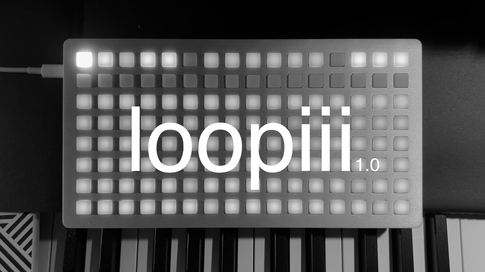
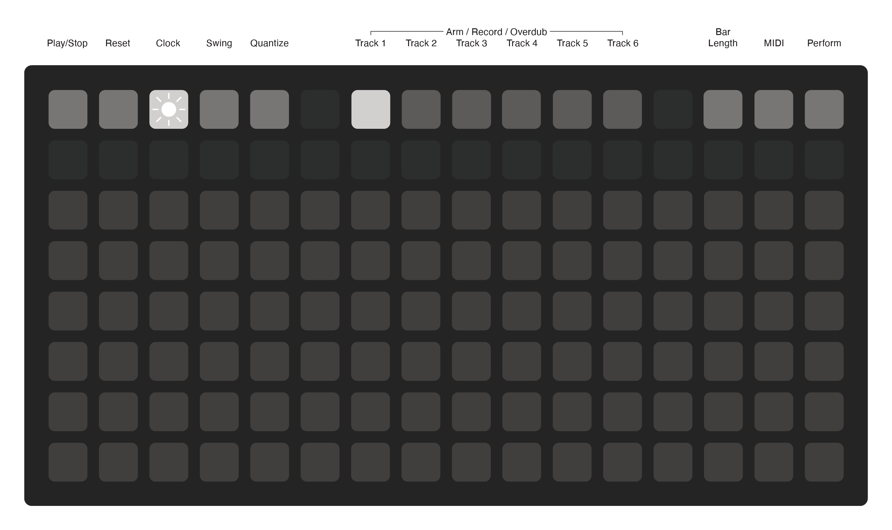
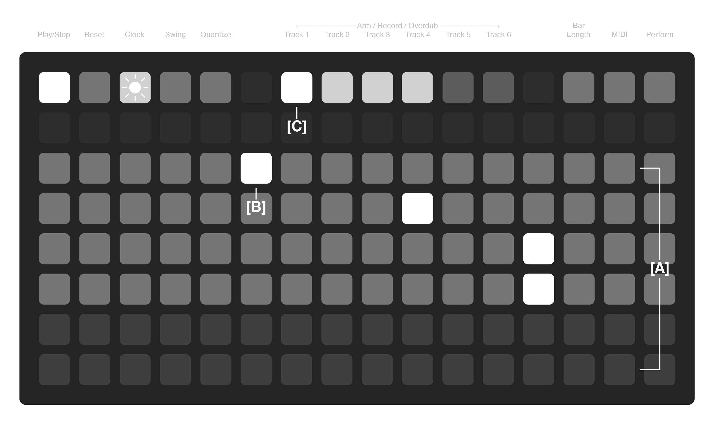
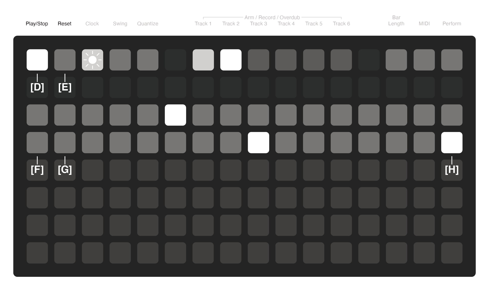
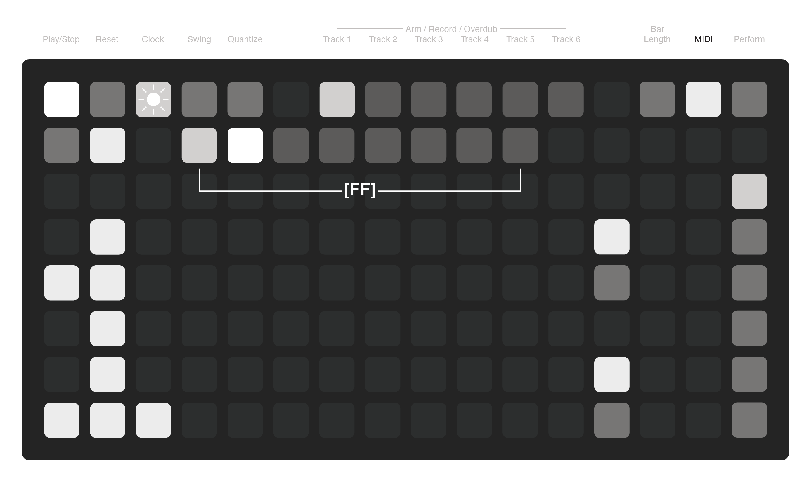

# loopiii
A multitrack MIDI looper for Monome Grid using iii

Current Version 1.0.0

## Overview
Loopiii is a 6-track MIDI looper with performance controls. The intuitive UI makes navigation and use as easy as possible without needing to memorize obscure button presses.

Loopiii allows for all tracks to be asynchronously or synchronously recorded to any length or a specific bar length. Loops can be overdubbed, quantized, slowed, sped up, time stretched, or played as a one-shot. Tracks can be synced to one another to share lengths and other properties.

Loopiii needs the input of another MIDI device to record notes and events. Combine loopiii with foot switches to control various functions without needing to interact with the grid directly.

## Loop Tracks
**[A] Loop Tracks**  
The loop tracks show the current status of each of the seven loops. While a loop is shown to take up a full row, each track can have independent durations. The duration of each track is determined by recording length.

Tracks that are empty are dimly lit and tracks with recorded loops are lit up and have an active playhead.

**[B] Playhead**  
Each track has an independent playhead to show the current position along the current loop length. The playhead will move along the track slower or faster depending on the duration of each track and the playback speed.

**[C] Current Track**  
The currently selected track will be lit up brighter than other tracks. This indicator is especially useful when selecting the current track using a foot pedal.

## Play/Stop & Reset
**[D] Play/Stop**
This button starts and stops the playback of all the loops. Tracks will continue from the position they were stopped at unless the reset button is pressed. When clocking externally, this button only functions as a stop.

_Shortcut:_  
Holding **[D]** for 2 seconds will clear all the recorded tracks.

**[E] Reset**  
This button resets each loop back to the beginning. Reset works in either clocking mode and can be handled by external resets sent through MIDI.

**[F] Play/Stop Per Track**  
This button acts as a play/stop control for the individual track allowing tracks to be played back at independent times.

**[G] Reset Per Track**  
This button acts as a reset control for the individual track bringing the playhead back to the start. It can be used for stutter effects.

**[H] One-Shot Mode**  
When the last button of a track is toggled, it puts the track into one-shot mode where it only plays through once, instead of looping.

## MIDI - Presets & CCs  
**[FF] MIDI Presets**  
Presets are only for saving MIDI configurations across all tracks. Presets can be saved by holding a slot for 2 seconds and loaded by pressing a slot.

Presets are numbered 1-8. In diii you will see files that look like this:  
`pset_loopiii_1.lua`

Global preset:  
`pset_loopiii_100.lua`
serves as a global state memory. It recalls the last loaded preset to run when the script starts. It is updated when pressing any preset button.

**MIDI CCs**
Loopiii has many functions that can be controlled from a momentary foot switch or any device that can send continuous control signals. This is the list of available controls:
| CC Number | Function |
| :--- | :--- |
| CC 102 | Global Play/Stop |
| CC 103 | Global Reset |
| CC 104 | Select Previous Track |
| CC 105 | Select Next Track |
| CC 106 | Record Current Track |
| CC 107 | Play/Stop Current Track |
| CC 108 | Reset Current Track |
| CC 109 | Mute Current Track |
| CC 110 | 1/2x Speed Current Track |
| CC 111 | 1x Speed Current Track |
| CC 112 | 2x Speed Current Track |

