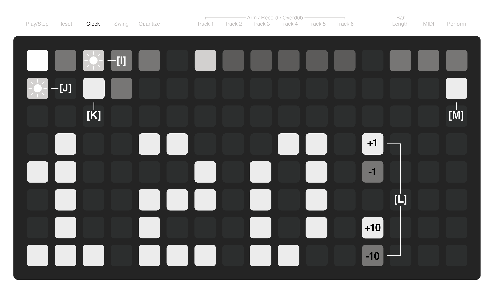
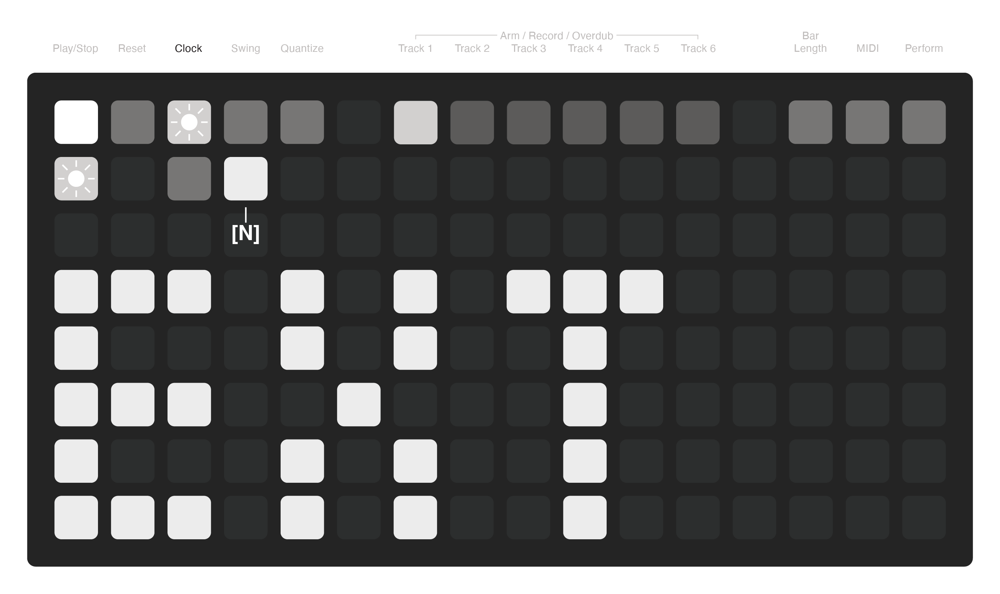
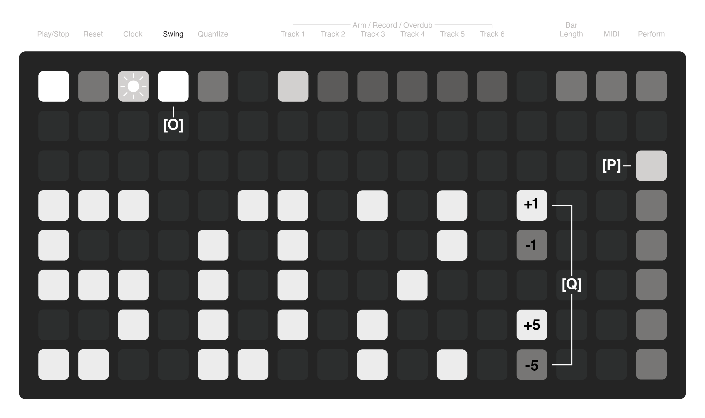
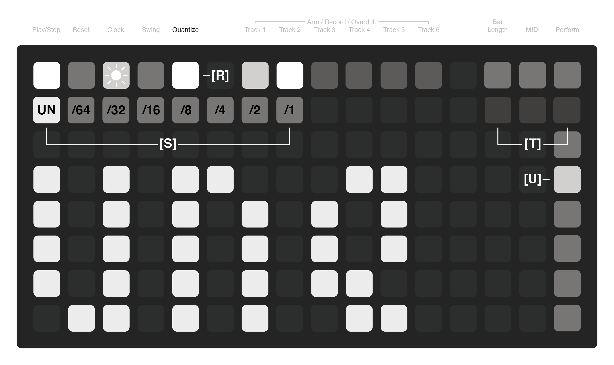
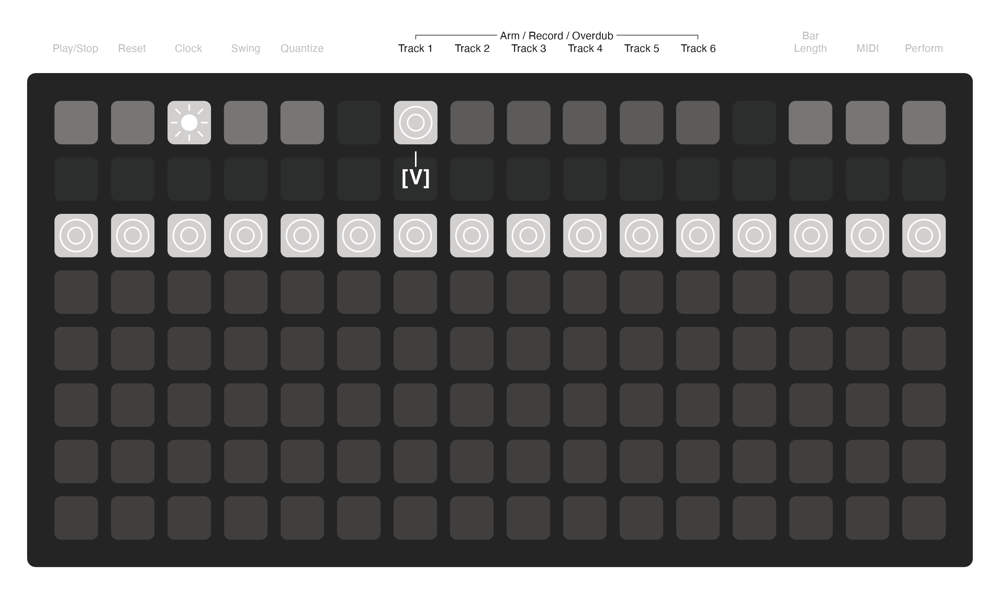
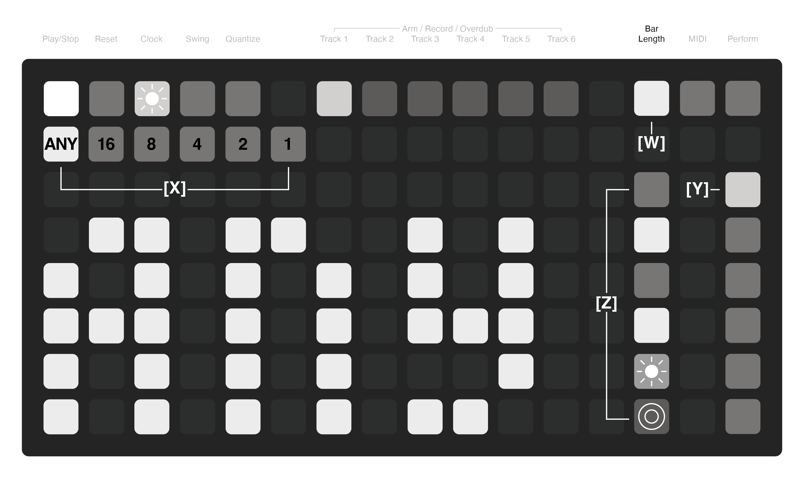
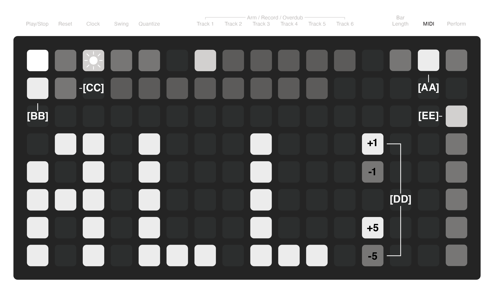
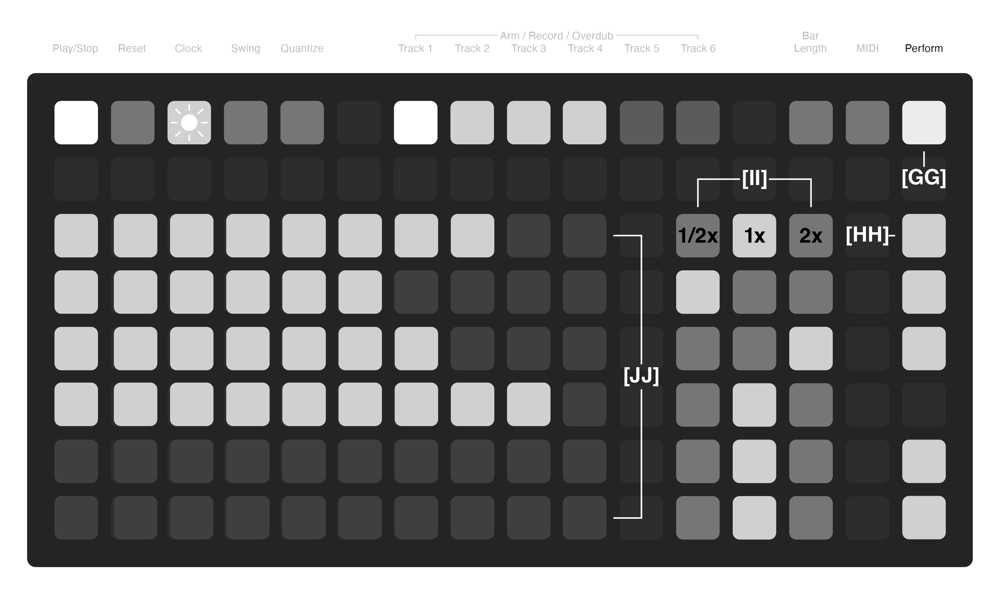

# loopiii
A multitrack MIDI looper for Monome Grid using iii

Current Version 1.0.0

## Overview
Loopiii is a 6-track MIDI looper with performance controls. The intuitive UI makes navigation and use as easy as possible without needing to memorize obscure button presses.

Loopiii allows for all tracks to be asynchronously or synchronously recorded to any length or a specific bar length. Loops can be overdubbed, quantized, slowed, sped up, time stretched, or played as a one-shot. Tracks can be synced to one another to share lengths and other properties.

Loopiii needs the input of another MIDI device to record notes and events. Combine loopiii with foot switches to control various functions without needing to interact with the grid directly.

## Loop Tracks
**[A] Loop Tracks**  
The loop tracks show the current status of each of the seven loops. While a loop is shown to take up a full row, each track can have independent durations. The duration of each track is determined by recording length.

Tracks that are empty are dimly lit and tracks with recorded loops are lit up and have an active playhead.

**[B] Playhead**  
Each track has an independent playhead to show the current position along the current loop length. The playhead will move along the track slower or faster depending on the duration of each track and the playback speed.

**[C] Current Track**  
The currently selected track will be lit up brighter than other tracks. This indicator is especially useful when selecting the current track using a foot pedal.

## Play/Stop & Reset
**[D] Play/Stop**  
This button starts and stops the playback of all the loops. Tracks will continue from the position they were stopped at unless the reset button is pressed. When clocking externally, this button only functions as a stop.

_Shortcut:_  
Holding **[D]** for 2 seconds will clear all the recorded tracks.

**[E] Reset**  
This button resets each loop back to the beginning. Reset works in either clocking mode and can be handled by external resets sent through MIDI.

**[F] Play/Stop Per Track**  
This button acts as a play/stop control for the individual track allowing tracks to be played back at independent times.

**[G] Reset Per Track**  
This button acts as a reset control for the individual track bringing the playhead back to the start. It can be used for stutter effects.

**[H] One-Shot Mode**  
When the last button of a track is toggled, it puts the track into one-shot mode where it only plays through once, instead of looping.

## Clock - Internal
**[I] Clock**  
The clock button toggles clock page and blinks at the current tempo.

**[J] Tap Tempo**  
This button is the tap tempo. Tap it ~4 times to set the internal tempo.

**[K] Internal Source**  
This button selects the internal clock and the BPM displays the current tempo.

**[L] Increments**  
The two sets of buttons next to the BPM display numbers are for increasing or decreasing the tempo.

**[M] Send MIDI Clock**  
When this button is toggled, a 24ppqn clock is sent out to other devices as well as signals for start, stop, and reset.

## Clock - External
**[N] External MIDI Source**  
This button sets the clock to look for an external MIDI signal. It responds to start, stop, and reset signals. EXT is now showing instead of the BPM display.

If the clock is set back to internal after using an external, the internal clock will reflect the previously used external clock (approximate).

## Swing
**[O] Swing**  
This button toggles the Swing page and shows the current swing value in the text display for the selected track.

**[P] Swing Track Select**  
This button column selects the track to edit for the swing value.

Swing can be adjusted from 25% to 75% with 50% being no swing. Swing set under 50% will cause the swung notes to arrive early and swing set over 50% will cause the swung notes to arrive late.

**[Q] Increments**  
The two sets of buttons next to the number display are for increasing or decreasing the swing.

_Shortcut:_   
Holding **[O]** and pressing an increment button will change all tracks to match the current value.

## Quantize
**[R] Quantize**  
All recordings are recorded unquantized to a 96ppqn tick, but playback can be altered to snap notes and recorded CC changes to quantized divisions for playback. The quantize settings can be turned on before a track is recorded, but will only take effect on the first playback.

**[S] Quantize Division**  
This button row sets the quantizer division to snap to. The quantizer can be set to unquantized or a division from 1/64 of a note to 1 whole note.

**[T] Division Modifiers**  
The modifier buttons allow the quantizer to be switched between straight time, triplets, and dotted notes.

_Shortcut:_   
Holding **[R]** and pressing a quantize division or modifier button will change all tracks to use the same settings.

**[U] Quantize Track Select**  
This button column selects the track to edit for the quantize settings.

## Recording - Arm, Record & Overdub
**[V] Arm Track**  
These buttons toggle the recording state for each track. Press a track’s record button once to arm it, and it will begin to pulse awaiting for the first note. Pressing the **[V]** button without recording will disarm the track.

While recording, the track will continue to pulse until the **[V]** button is pressed again to end the recording or the set bar length has been reached. Once recording is done, the track will turn solid and the playhead will begin to move across the track.

Press the track’s **[V]** button again to put the track into overdub mode and keep recording on top of the original loop. The playhead will keep running while overdubbing.

Holding **[V]** for 2 seconds will clear the loop.

Note that only one track can record or overdub at one time. Arming a different track will shift the focus to that track and disengage the previously selected track, ending the recording.

The looper must also be running to record or overdub and will begin to play automatically if stopped.

## Bar Length
**[W] Bar Length**  
This button toggles the page change the bar length of the individual tracks of the looper.

**Time Stretch**  
Any track can be time stretched to fit any of the bar length durations after it is recorded.

**[X] Bar Lengths**  
Each track can have a bar length of any duration or be set to 16, 8, 4, 2, or 1 bar. Bar length is based on a four beat measure and the BPM. For instance, at 120 BPM an 8 bar loop is 16 seconds. Choose a bar length before recording to set the loop to stop recording at that length.

_Shortcut:_   
Holding **[W]** and pressing a bar length will change all tracks to use the same length.

**[Y] Bar Length Track Select**  
This button column selects the track to edit its bar length.

**[Z] Sync Groups**  
This column of buttons allows tracks to be synced to three different groups—solid, blink, or pulse. Tracks record in time with each other on the initial recording and change lengths together.

## MIDI - Channels
**[AA] MIDI**  
This button toggles the MIDI page and shows the settings for each track. Each loop can play record and play on separate channels.

**[BB] MIDI In Channel**  
This button shows the current MIDI in channel. By default, it is set to ALL.

**[CC] MIDI Out Channel**  
This button shows the current MIDI out channel. By default, it is set to 1.

**[DD] Increments**  
The two sets of buttons next to the number display are for increasing or decreasing the MIDI channel.

MIDI channels can range from OFF, ALL, or 1–16.

_Shortcut:_   
Holding **[AA]** and pressing an increment button will change all tracks to match the current value.

**[EE] MIDI Track Select**
This button column selects the track to edit its MIDI channel.

## MIDI - Presets & CCs  
**[FF] MIDI Presets**  
Presets are only for saving MIDI configurations across all tracks. Presets can be saved by holding a slot for 2 seconds and loaded by pressing a slot.

Presets are numbered 1-8. In diii you will see files that look like this:  
`pset_loopiii_1.lua`

Global preset:  
`pset_loopiii_100.lua`
serves as a global state memory. It recalls the last loaded preset to run when the script starts. It is updated when pressing any preset button.

**MIDI CCs**
Loopiii has many functions that can be controlled from a momentary foot switch or any device that can send continuous control signals. This is the list of available controls:
| CC Number | Function |
| :--- | :--- |
| CC 102 | Global Play/Stop |
| CC 103 | Global Reset |
| CC 104 | Select Previous Track |
| CC 105 | Select Next Track |
| CC 106 | Record Current Track |
| CC 107 | Play/Stop Current Track |
| CC 108 | Reset Current Track |
| CC 109 | Mute Current Track |
| CC 110 | 1/2x Speed Current Track |
| CC 111 | 1x Speed Current Track |
| CC 112 | 2x Speed Current Track |

## Perform - Mute, Play Speed & Velocity
**[GG] Perform**  
This button toggles the Perform page with mutes, play speed, and velocity controls per track. 

_Shortcut:_  
Holding **[GG]** and pressing a mute, speed, or velocity setting will set all the tracks at once.

**[HH] Mutes**  
The right column is a mute for each track. A track is muted when its button is off and will play when lit.

**[II] Play Speed**  
The three columns of buttons is the play speed control. The left button switches the track to play back at half speed, the middle normal, and the right double. Play speed simply adjusts the loop speed, so it adjusts to changes in the BPM and the bar length.

**[JJ] Velocity**  
The rows control the velocity output of each track. They act as a sort of track volume control. When recording, the note with the highest velocity sets the initial level and it can be scaled by a multiplier to adjust max output velocity level. This control might not make much difference if the device receiving MIDI doesn’t respond to velocity.

